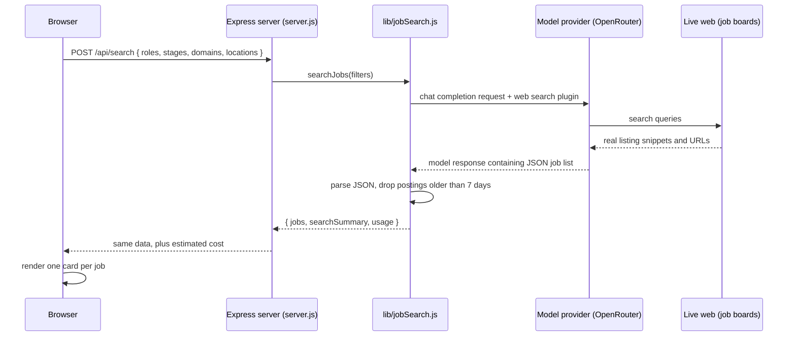

# Architecture

This app finds real, currently open (last 7 days) India startup job postings and
matches them against one candidate's profile, using a live web search. There are
two ways to use it: a browser page, and an MCP server. Both call the same search
logic underneath.

## The problem this design solves

The very first version of this app called the AI provider's API directly from
the browser, with the API key embedded in the page's JavaScript. That doesn't
work: browsers block cross-origin calls like that, and any key placed in
client-side code is visible to anyone who opens developer tools. Every version
since has run the actual API call on a small server, so the browser only ever
talks to our own server, and the key never leaves it.

## Components

| Piece | File | Job |
|---|---|---|
| Browser UI | `public/index.html` | Lets a person pick filters and see results as cards. Holds no secrets. |
| Web server | `server.js` | Small Express app. Serves the UI and exposes one endpoint, `POST /api/search`. |
| Shared search logic | `lib/jobSearch.js` | Builds the prompt, calls the model provider, filters and prices the response. Used by both the web server and the MCP server, so the logic exists once. |
| MCP server | `mcp-server/` | Exposes the same search as a tool an AI agent can call directly. See [`MCP_SERVER.md`](./MCP_SERVER.md). |

## Request flow (web app)



Nothing in this flow lets the browser see the provider's API key — it is read
once, on the server, from an environment variable.

## What happens to one response, step by step

The model provider replies with a single block of text, not ready-made job
objects. Turning that into rendered cards is a small pipeline:

1. The provider's reply arrives as `choices[0].message.content` — one long
   string that may include explanation text and markdown code fences around
   the JSON.
2. `extractJson()` strips any ```` ```json ```` fences and takes the substring
   between the first `{` and the last `}`, then parses it.
3. The parsed object is `{ jobs: [...], searchSummary: "..." }`.
4. The server drops any job whose `postedDays` is greater than 7, as a safety
   net in case the model's own filtering slips.
5. The server attaches usage and cost information and sends the result back
   as one JSON response.
6. In the browser, `renderJobs()` sorts by match score and builds one HTML
   card per job.

## Demo mode

Setting `DEMO_MODE=1` skips the model provider call entirely and returns two
clearly labeled sample jobs. This is useful for looking at the UI, or for
running the server with no API key and no cost.

## Cost and usage tracking

Every real search logs prompt/completion token counts and an estimated dollar
cost, taken directly from the provider's response (`usage.cost` on
OpenRouter). The same numbers are returned to the browser and shown in the
UI's activity log, so cost is visible per search rather than only on a
billing dashboard.

## Running it

```bash
cp .env.example .env
# add OPENROUTER_API_KEY, or set DEMO_MODE=1 to skip it
npm install
npm start
```

Opens on `http://localhost:3000`.
