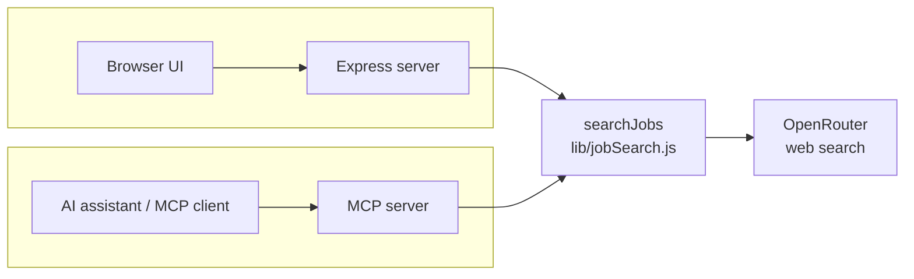
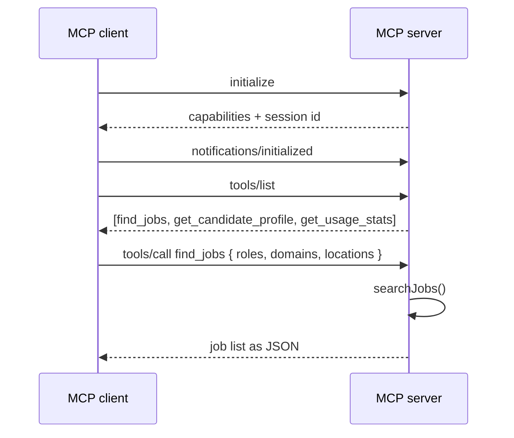

# MCP Server

`mcp-server/` exposes the same job search as a tool that an AI assistant can
call directly, instead of only being available through the browser page.

## Why this exists

The web app already does the job: a person opens a page, picks filters, and
gets results. That's built for a human clicking a button. If an AI assistant
(Claude, or any other MCP-aware agent) should be able to run this search on
its own — as part of a longer conversation, without a person filling out a
form — it needs a way to discover that the capability exists and call it in a
standard way. That's what MCP (Model Context Protocol) provides.

Both the web app and the MCP server call the same function,
`searchJobs()` in `lib/jobSearch.js`. The business logic — the prompt, the
7-day recency filter, the cost calculation — exists once and is reused by
both.



## What it exposes

| Kind | Name | What it does |
|---|---|---|
| Tool | `find_jobs` | Runs the live job search with optional role/stage/domain/location filters |
| Tool | `get_candidate_profile` | Returns the candidate profile the search matches against |
| Tool | `get_usage_stats` | Returns call counts and total estimated spend since the server started |
| Resource | `profile://candidate` | The candidate profile, exposed as read-only reference data |
| Resource | `config://server` | Non-secret runtime configuration (model name, demo mode) |
| Prompt | `job_search_brief` | A ready-made prompt that kicks off a search |

A **tool** is something the AI decides to call on its own during a
conversation, based on what's being discussed — similar to "function calling"
in other AI APIs. A **resource** is read-only data that gets attached to the
conversation, not something the AI decides to fetch by itself. A **prompt**
is a template a person can trigger explicitly.

## How a request actually works

1. A client (the AI assistant's host application) connects and sends an
   `initialize` message describing what it supports.
2. The server responds with its own capabilities and a session ID.
3. From then on, every message from that client carries the same session ID,
   so the server can serve many clients at once without mixing up their
   state.
4. The client can ask `tools/list` to see what's available, then send
   `tools/call` with a tool name and arguments to actually run it.
5. `find_jobs` runs the same `searchJobs()` used by the web app and returns
   the job list as its result.



## How this differs from a regular API

A regular API (like the web app's `/api/search` endpoint) has one URL, one
request shape that a developer has to already know, and no built-in way for a
caller to discover what it does — that lives in a README or a hand-written
spec. MCP standardizes that discovery step (`tools/list`) and the calling
convention (`tools/call`), so any MCP-compatible client works with any
MCP-compatible server without custom integration code for that specific pair.
The tradeoff: if only one application will ever call this, the extra protocol
layer doesn't buy much over a plain endpoint. It's worth it once more than one
AI application needs to reuse the same capability, or once the caller is an
AI agent deciding for itself, mid-conversation, when to use it — not a
developer who pre-wired the call.

## What's added for running this outside a laptop

The protocol itself doesn't define authentication, rate limiting, or logging
— those are left to whoever builds the server. This one adds:

- **Bearer token check** on the `/mcp` and `/metrics` endpoints
  (`MCP_API_KEYS`). Left unset for local use; the server logs a warning on
  every request while it's unset so that's visible.
- **Rate limiting** on the MCP endpoint.
- **Structured logging** (one JSON line per request) instead of plain text.
- **Health check** at `/healthz`, unauthenticated, for load balancers or
  container orchestrators to poll.
- **Config validation at startup** — a bad `.env` fails immediately with a
  clear message instead of failing on the first real request.
- **Graceful shutdown** — closes every open client session cleanly on
  `SIGTERM`/`SIGINT` instead of dropping connections mid-request.

The current session store is in memory. That's fine for one server process;
running more than one instance behind a load balancer would need a shared
store (e.g. Redis) so any instance can serve any client's session.

## Running it

```bash
cd mcp-server
cp .env.example .env
npm install
npm start
```

Listens on `http://localhost:4000/mcp`.

### Trying it out

With the server running, in a second terminal:

```bash
npm run inspect
```

This opens the MCP Inspector, a browser tool for calling an MCP server by
hand. Connect with:

- Transport type: `Streamable HTTP`
- URL: `http://localhost:4000/mcp`
- Authorization header: `Bearer <value of MCP_API_KEYS>` (skip if unset)

### Connecting an AI assistant

Add to the assistant's MCP configuration:

```json
{
  "mcpServers": {
    "job-search-agent": {
      "url": "http://localhost:4000/mcp",
      "headers": { "Authorization": "Bearer <your MCP_API_KEYS value>" }
    }
  }
}
```
